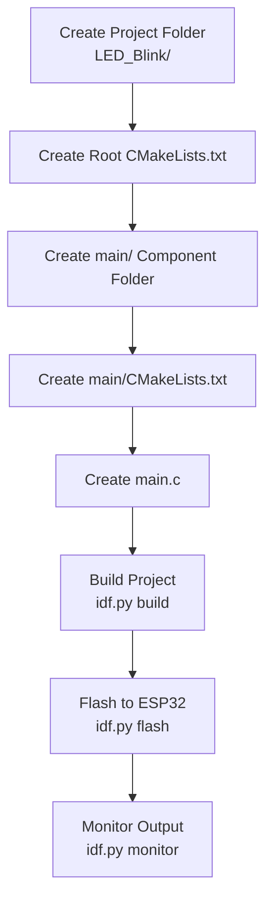

## คู่มือสร้างโปรเจกต์ ESP32 From Scratch (ESP-IDF)

### 1 ลำดับการสร้าง



### 2 โครงสร้างโฟลเดอร์โปรเจกต์

```
LED_Blink/
├── CMakeLists.txt
└── main/
    ├── CMakeLists.txt
    └── main.c
```
### 3 สร้างโฟลเดอร์โปรเจกต์

เริ่มต้นโปรเจกต์
นี่คือ root directory ของโปรเจกต์ ESP32
- เปิดโฟลเดอร์งาน
- สร้างโฟลเดอร์ใหม่ชื่อ **LED_Blink**
- โครงสร้างตอนนี้
	`LED_Blink/`

### 4 สร้างไฟล์ CMakeLists.txt ของ root

ไฟล์นี้สำคัญมาก มันบอก ESP-IDF ว่าโปรเจกต์นี้ชื่ออะไรและจะ build อะไร

- สร้างไฟล์: **LED_Blink/CMakeLists.txt**
- ใส่เนื้อหา

```cmake
cmake_minimum_required(VERSION 3.5)
include($ENV{IDF_PATH}/tools/cmake/project.cmake)
set(IDF_TARGET "esp32")
project(LED_Blink)
```

#### **รายละเอียดคำสั่งในไฟล์ CMakeLists.txt ของ root** 
**4.1) `cmake_minimum_required(VERSION 3.5)`**
**บอก CMake ว่าโปรเจกต์นี้ต้องใช้ CMake เวอร์ชันขั้นต่ำ 3.5**
- ESP-IDF ใช้ CMake เป็น build system
- ถ้าเครื่องมี CMake ต่ำกว่า 3.5 → จะ error ทันที
- เป็นการ “ล็อกเวอร์ชัน” เพื่อให้ build reproducible
**4.2) `include($ENV{IDF_PATH}/tools/cmake/project.cmake)`**
**โหลดระบบ build ของ ESP-IDF**
- `$ENV{IDF_PATH}` คือ path ของ ESP-IDF ที่ถูก export ไว้
- ไฟล์ `project.cmake` จะทำงานหลายอย่าง เช่น
    - ตั้งค่า toolchain
    - ตั้งค่า compiler flags
    - โหลด component manager
    - สแกนโฟลเดอร์ `main/`
    - สร้าง target ชื่อเดียวกับ project
**4.3) `set(IDF_TARGET "esp32")`**
**กำหนดชิปที่ใช้**
- ESP-IDF รองรับหลายชิป เช่น ESP32, ESP32-S3, ESP32-C3
- ควรระบุ target ให้ชัดเจนเพื่อป้องกัน build ผิดชิป

**4.4) `project(LED_Blink)`**
**ประกาศชื่อโปรเจกต์**
- ชื่อโปรเจกต์ = ชื่อ target หลักของ ESP-IDF
- ใช้เป็นชื่อ binary ที่จะถูก flash ลง ESP32
- ใช้เป็นชื่อโฟลเดอร์ build เช่น `build/LED_Blink.bin`
### 5 สร้างโฟลเดอร์ component ชื่อ main
main คือ component หลักที่เก็บโค้ด C
- สร้างโฟลเดอร์: **`LED_Blink/main`**
- โครงสร้างตอนนี้:
     `LED_Blink/`
        `CMakeLists.txt`
        `main/`
### 6 สร้างไฟล์ CMakeLists.txt ของ main component
กำหนด component
ไฟล์นี้บอกว่า main component มีไฟล์อะไรบ้าง
- สร้างไฟล์: **`LED_Blink/main/CMakeLists.txt`**
- ใส่เนื้อหา:

```cmake
idf_component_register(SRCS "main.c" INCLUDE_DIRS ".")
```

### 7 สร้างไฟล์ main.c
พร้อม build
นี่คือโค้ดหลักที่จะรันบน ESP32
- สร้างไฟล์: **`LED_Blink/main/main.c`**
- ใส่โค้ดตัวอย่าง:

```c
#include <stdio.h>
#include "freertos/FreeRTOS.h"
#include "freertos/task.h"
#include "driver/gpio.h"

#define LED_PIN 2

void app_main(void)
{
    gpio_set_direction(LED_PIN, GPIO_MODE_OUTPUT);

    while (1) {
        gpio_set_level(LED_PIN, 1);
        vTaskDelay(500 / portTICK_PERIOD_MS);
        gpio_set_level(LED_PIN, 0);
        vTaskDelay(500 / portTICK_PERIOD_MS);
    }
}
```

## วิธี Build & Flash

ใน terminal:

```
idf.py build
idf.py -p /dev/ttyUSB0 flash
idf.py monitor
```
